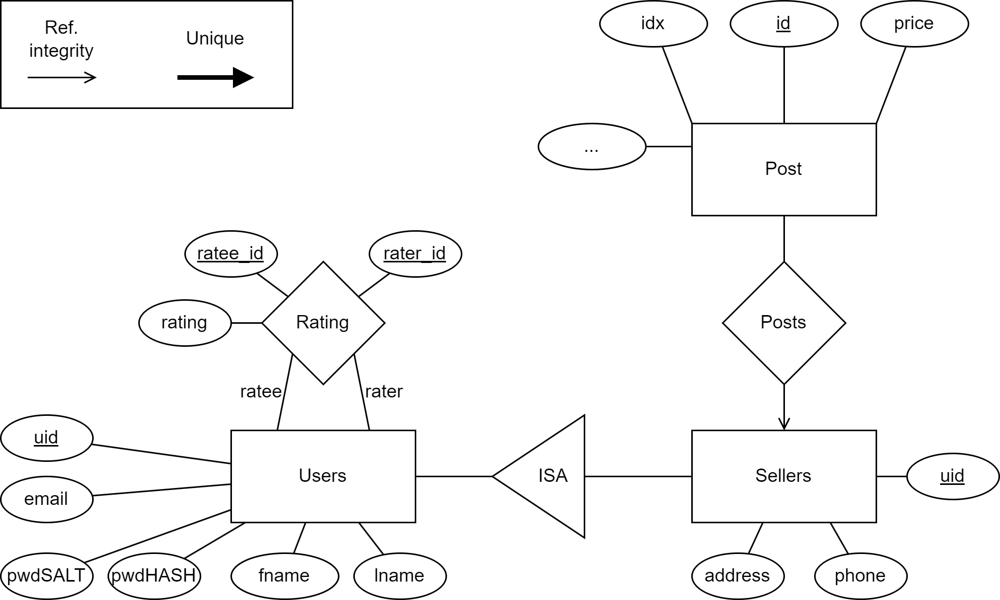

# E/R

# Initialization
The website runs plug-and-play in Docker. All you have to do is go to the source directory and run ``docker-compose up``. The website can then be accessed on <http://localhost:3000/>, while the API runs on <http://localhost:8088/>.

# The dataset
The cardata was found at:
<https://www.kaggle.com/datasets/austinreese/craigslist-carstrucks-data>

All the userdata in the database is randomly generated, and if you wish to reroll it, simply:

1) Delete ``cars.csv``, ``users.csv``, ``sellers.csv``, and ``ratings.csv`` from ``/server/config``.
2) Run ``/Utils/generate_users.py``.
3) Copy the newly generated  ``cars.csv``, ``users.csv``, ``sellers.csv``, and ``ratings.csv`` to ``/server/config``.
4) Delete the old Docker images before running the application again.

# Interaction with the website
## Browsing cars
You can browse through cars in the database on the home page. Here you can click on a category, and choose the attributes of the cars you want to search for. You can, for example, choose the `cartype`, to be a `pickup` or an `SUV`. Numeric categories work a bit differently, as you can choose a numeric range by setting a `from` and `to` number, which in the case of the price categories means that you will only get cars that cost more or equal to `from`, and less or equal to `to`. In the top of the page you can also see the number of cars that have those attributes in the database. To see a specific car, you can click on the cars shown on the page, which will redirect you to its post.

## Viewing specific post
Once you have found a car of your interest you can press to get more information about it. Here you will see every attribute it has and a user written description. Descriptions vary in size hence you can press `read more` to get the view of the entire description and then `read less` to view the default 510 characters (roughly 6 lines). Underneath the post itself there will be a section with `recommended cars`. The recommended cars will be cars that have the same or similar cartype, color, and price attributes and it can not have the same ID as the car itself meaning it will not recommend the same car as the one you are viewing.

## Finding sellers page
To see the seller of a certain post click on the user seller under the image of the car of the post. This will take you to the sellers page where you will be able to see the first 10 posts that the seller made.

## Registering, and logging in
You can register an account on the site with the button on the top right. The signup process is quite straightforward, but make sure to read the terms and conditions, as they contain some nonstandard clauses.
After the signup, you’re automatically logged in, and can now access your own user-page by clicking your username, as well as rate other users by clicking on the number of stars you think they deserve. You can change the rating at any time, but only give one rating per user, so if you feel like review-bombing them, you’ll have to use several accounts. If you get lazy, or find the TOS too strict, you can also just sign into any of the initial accounts from their UID (found in the link to their account page) using the username ``(UID)@test.com`` and password ``test123``.

# Shortcomings
## Car images
The site only has 13 different images (with one being an unknown/other) for cars even though the site has more than 30 000 cars. Each image represents the car type and not the car itself i.e. all pickups will look the same regardless of make, model, year, color etc.

## Users
Every user has the same image which is a placeholder image for a user. Furthermore, you can’t make any posts.

## Seller location vs. post location
The location of the post and the sellers location might not make sense e.g. the seller might be located in WA and the car is located in CA. This is due to the dataset being from two different sources.
